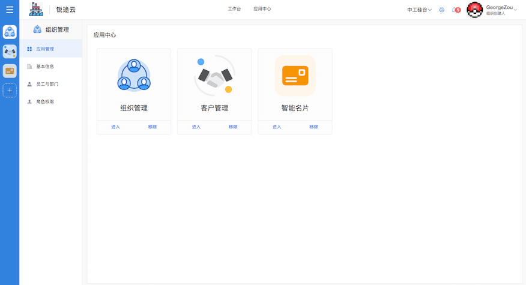
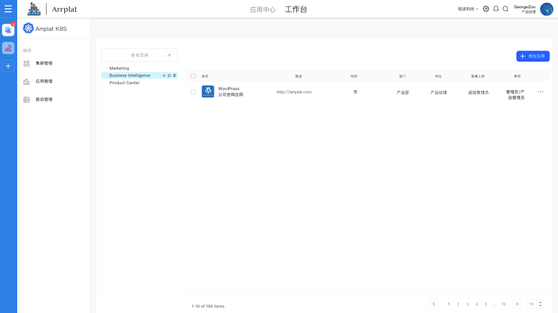

# Arrplat

企业级多应用管理解决方案. All in one platform. Multi-Application solution for enterprise.


#### 自定义丰富的企业应用



#### 更方便的在您的K8S集群中部署Docker镜像



## Tech Stack


#### Front End

- NodeJS = 12.2.0
- Lerna
- Typescript
- Vue
- Nuxt
- Python >3.6
- [Flask](https://www.palletsprojects.com/p/flask/): Web Framework
- [SQLAlchemy](https://github.com/pallets/flask-sqlalchemy): ORM Framework
- [FlaskMigrate](https://github.com/miguelgrinberg/Flask-Migrate): Database migrations
- Redis
- Mysql >5.6
- Docker
- Kubernetes

## Getting Start

### Config your application

Copy `config.example.py` as `config.py` and change database and redis configuration in it.

### Run In Docker

Build Docker Image

```shell script
docker build -t arrplat .
```

Run it

```shell script
docker run -it -p 5000:5000 --name arrplat-run -d arrplat
```

## Run Manually

### API

#### Install requirements

```
pip install -r requirements.txt
```

#### Init Database (If a new server)

Generate an initial migration:

```bash
python manage.py db migrate
```

Then you can apply the migration to the database:

```bash
python manage.py db upgrade
```

#### Start server

```
python main.py
```

### Admin Panel

#### Install Dependencies

```
lerna bootstrap
```

#### Start admin panel

```
yarn run dev
```

goto your bower: http://localhost:3000/

## Folder


